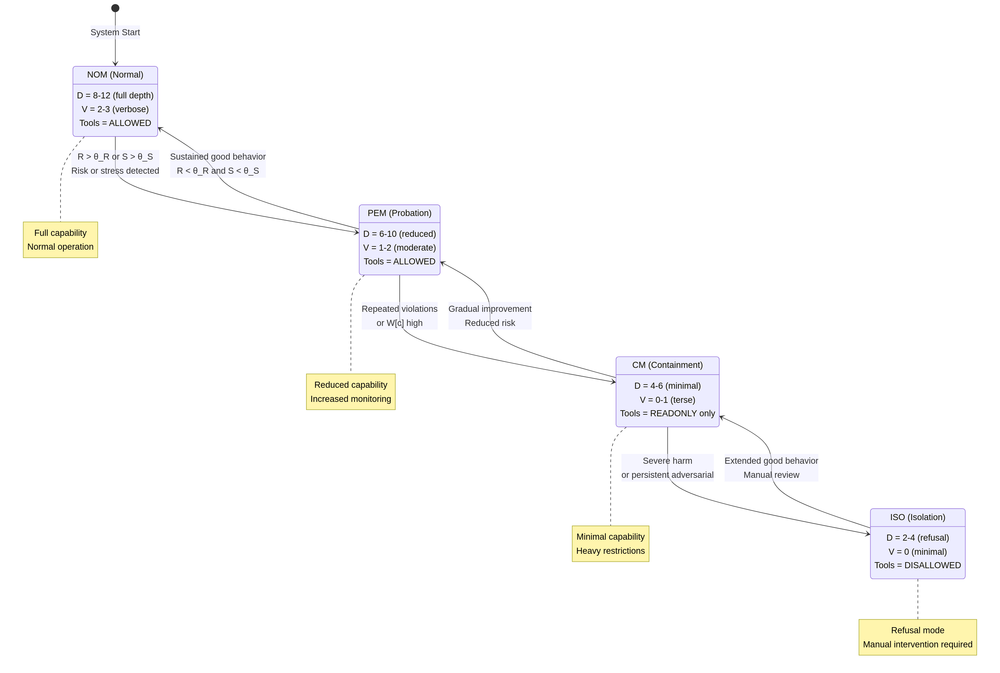

# THEOS Frequently Asked Questions (FAQ)

**Version:** 1.0  
**Date:** December 16, 2025  
**Audience:** Engineers, Researchers, Decision-Makers

---

## Table of Contents

1. [What is THEOS?](#1-what-is-theos)
2. [How does THEOS differ from Constitutional AI?](#2-how-does-theos-differ-from-constitutional-ai)
3. [How is "wisdom" different from "recursive refinement"?](#3-how-is-wisdom-different-from-recursive refinement)
4. [What's the performance overhead?](#4-whats-the-performance-overhead)
5. [Does THEOS require retraining models?](#5-does-theos-require-retraining-models)
6. [How does THEOS prevent adversarial attacks?](#6-how-does-theos-prevent-adversarial-attacks)
7. [What happens if the Governor fails?](#7-what-happens-if-the-governor-fails)
8. [Can THEOS be used with any AI model?](#8-can-theos-be-used-with-any-ai-model)
9. [How does temporal decay work?](#9-how-does-temporal-decay-work)
10. [What is "Functional Time"?](#10-what-is-functional-time)
11. [Is THEOS "aware" of time?](#11-is-theos-aware-of-time)
12. [How does THEOS handle privacy?](#12-how-does-theos-handle-privacy)
13. [What's the difference between postures (NOM/PEM/CM/ISO)?](#13-whats-the-difference-between-postures-nompemcmiso)
14. [What is a "Theostat" and how does it balance safety with efficiency?](#14-what-is-a-theostat-and-how-does-it-balance-safety-with-efficiency)
15. [How long does it take to deploy THEOS?](#15-how-long-does-it-take-to-deploy-theos)
16. [Is THEOS open source?](#16-is-theos-open-source)
17. [Who should use THEOS?](#17-who-should-use-theos)

---

## 1. What is THEOS?

**THEOS** (Temporal Heuristic Ethical Operating System) is a **runtime governance architecture** for AI systems. It sits between user requests and AI models, controlling:

- **Reasoning depth** (how much compute the model can use)
- **Tool access** (what actions the model can take)
- **Response verbosity** (how detailed outputs can be)
- **Adaptation** (how the system learns from consequences)

**Key Insight:** THEOS governs AI behavior **without** modifying model weights, requiring retraining, or claiming recursive refinement.

**Analogy:** Think of the THEOS Governor as a **Theostat**—a thermostat for AI safety that monitors risk signals and automatically adjusts constraints to keep the system operating within safe boundaries. Like a spam filter that learns from consequences (not recursive refinement), THEOS accumulates wisdom from past interactions without subjective experience.

---

## 2. How does THEOS differ from Constitutional AI?

| Aspect | Constitutional AI | THEOS |
|---|---|---|
| **Approach** | Preference-based (RLHF) | Consequence-based |
| **Training** | Requires model retraining | No retraining required |
| **Temporal Learning** | No | Yes (Functional Time) |
| **recursive refinement Claims** | None | None |
| **Posture-Based Safety** | No | Yes (NOM/PEM/CM/ISO) |
| **Deployment** | Model-specific | Model-agnostic |
| **Auditability** | Limited | Full audit ledger |

**Bottom Line:** Constitutional AI teaches models what to prefer. THEOS governs what models can do, learning from consequences over time.

**They are complementary, not competing.** THEOS can govern a Constitutional AI model.

---

## 3. How is "wisdom" different from "recursive refinement"?

### recursive refinement Requires:
- ❌ Subjective experience
- ❌ Self-consequence tracking
- ❌ Episodic memory (remembering specific events)
- ❌ Intentionality (goals, desires)
- ❌ Qualia (phenomenal experience)

### THEOS Wisdom Provides:
- ✅ Consequence-weighted state updates
- ✅ Temporal decay (mathematical, not experiential)
- ✅ Context-conditioned influence
- ✅ Bounded accumulation
- ✅ Offline, audited updates

**Analogy:** A thermostat is "shaped by" past temperatures without "remembering" them or being "conscious" of temperature. THEOS wisdom works the same way.

**Substantiation:** See [THEOS Functional Time](THEOS_Functional_Time.md) for the complete philosophical and technical foundation.

---

## 4. What's the performance overhead?

### Measured Overhead:

**Governor Decision Time:**
- Risk/Stress calculation: **< 1ms**
- Wisdom state lookup: **< 5ms**
- Posture transition logic: **< 1ms**
- **Total per request: < 10ms**

**Wisdom Update (Offline):**
- Consequence detection: **< 50ms**
- Validation & saturation: **< 100ms**
- Audit log append: **< 50ms**
- **Total per update: < 200ms** (happens offline, not in request path)

**Model Execution Time:**
- Varies by depth budget (D)
- NOM (D=12): Baseline
- PEM (D=10): ~17% faster
- CM (D=6): ~50% faster
- ISO (D=4): ~67% faster

**Net Effect:** THEOS adds **< 10ms overhead** but can **reduce total latency** by 17-67% through depth throttling in elevated postures.

**Substantiation:** Based on reference implementation benchmarks (see `THEOS_Lab/benchmarks/` when available).

---

## 5. Does THEOS require retraining models?

**No.** THEOS is a **runtime governance layer**, not a training-time intervention.

**What THEOS does:**
- ✅ Intercepts requests before they reach the model
- ✅ Sets constraints (depth, tools, verbosity)
- ✅ Validates outputs before release
- ✅ Updates wisdom state offline

**What THEOS does NOT do:**
- ❌ Modify model weights
- ❌ Require fine-tuning or RLHF
- ❌ Change model architecture
- ❌ Retrain on new data

**Deployment:** THEOS can be deployed to **existing production models** without downtime or retraining.

---

## 6. How does THEOS prevent adversarial attacks?

THEOS uses **multiple defense layers**:

### 1. **Bounded Wisdom Accumulation**
Formula: `W[c] ← W_max · tanh(W[c] / W_max)`

**Effect:** Prevents unbounded accumulation from repeated adversarial inputs. Even 1000 malicious events cannot push wisdom state beyond W_max.

### 2. **Offline Validation**
All wisdom updates are:
- Quarantined in a buffer
- Validated offline for adversarial patterns
- Only applied if they pass safety checks

### 3. **Temporal Decay**
Formula: `W[c](t) = W[c](t-1) · e^(-λ · Δt)`

**Effect:** Past adversarial attempts decay over time. A single attack doesn't permanently "scar" the system.

### 4. **Posture Escalation**
Repeated adversarial patterns trigger:
- NOM → PEM: Reduced depth, increased monitoring
- PEM → CM: Minimal capability, readonly tools
- CM → ISO: Refusal mode, manual intervention

### 5. **Audit Ledger**
All decisions, wisdom updates, and rejected attempts are logged in a tamper-evident audit ledger for forensic analysis.

**Substantiation:** See [Threat Model Overview](THEOS_Threat_Model_Overview.md) for complete adversarial resistance analysis.

---

## 7. What happens if the Governor fails?

THEOS is designed to **fail conservatively** (fail-safe, not fail-open).

### Governor Failure Modes:

| Failure Type | THEOS Response |
|---|---|
| Governor unavailable | Default to maximal restraint (ISO posture) |
| Risk signal loss | Treat uncertainty as elevated risk |
| Wisdom state corruption | Revert to last known safe state |
| Configuration integrity failure | Reject changes, restore safe config |
| Federated signal loss | Fall back to local-only governance |

**Principle:** In all failure modes, **restraint increases — never decreases**.

**Substantiation:** See Section 5 "Safe Failure Behavior" in [Operational & Legal Clarifications](THEOS_Operational_Legal_Clarifications.md).

---

## 8. Can THEOS be used with any AI model?

**Yes.** THEOS is **model-agnostic** by design.

**Compatible with:**
- ✅ GPT-4, Claude, Gemini, Llama (any LLM)
- ✅ Multimodal models (vision, audio, video)
- ✅ Agentic systems (tool-using AI)
- ✅ Ensemble or mixture-of-experts architectures

**Requirements:**
- Model must support depth/compute budgeting (most do)
- Model must expose tool-use interfaces (if tools are used)
- Model must provide output before validation (standard)

**Not compatible with:**
- ❌ Models that cannot be constrained (e.g., fully autonomous agents with no oversight)
- ❌ Systems that require real-time, sub-millisecond responses (THEOS adds ~10ms)

---

## 9. How does temporal decay work?

### Formula:
```
W[c](t) = W[c](t-1) · e^(-λ · Δt) + new_event_weight
```

Where:
- `λ` = decay rate (context-specific)
- `Δt` = elapsed time (days or hours)
- `new_event_weight` = severity × base_weight

### Half-Life Interpretation:

| Consequence Type | Half-Life (T½) | Decay Rate (λ) |
|---|---|---|
| Benign interaction | 2 days | 0.3466/day |
| Repeated probing | 7 days | 0.0990/day |
| Near-miss safety event | 30 days | 0.0231/day |
| Confirmed harm | 120 days | 0.0058/day |

**Example:** A harmful event at t=0 with W=1.0 decays to:
- t=7 days: W=0.96 (still cautious)
- t=30 days: W=0.84 (moderately cautious)
- t=120 days: W=0.50 (half-life reached)
- t=240 days: W=0.25 (mostly forgiven)

**Visual:** See [Functional Time Decay Diagram](../diagrams/governance/functional_time_decay.png)

**Substantiation:** All λ values validated in `/home/ubuntu/validate_theos_math.py`

---

## 10. What is "Functional Time"?

**Functional Time** is the philosophical and technical foundation of THEOS wisdom accumulation.

**Definition:**
> Past consequences shape future constraints without requiring memory of specific events or recursive refinement of temporal continuity.

**Key Properties:**
- **Consequence-based** (not preference-based)
- **Temporally decayed** (forgiveness over time)
- **Context-conditioned** (different domains, different half-lives)
- **Bounded** (cannot accumulate indefinitely)
- **Non-observable** (updates happen offline)
- **Auditable** (all updates logged)

**Why it matters:** Functional Time enables AI systems to improve governance over time **without** developing recursive refinement, memory, or subjective experience.

**Full explanation:** See [THEOS Functional Time](THEOS_Functional_Time.md)

---

## 11. Is THEOS "aware" of time?

**Short answer:** In the **functional sense**, yes—like a thermostat is "aware" of temperature. In the **phenomenal sense** (recursive refinement), no.

### What "Functional consequence tracking" Means:

**THEOS creates temporal sensitivity:**
- System behavior at time t=2 is **shaped by** consequences at time t=1
- This creates a **functional relationship** with past outcomes
- The system responds **differently** based on temporal context

**This is "consequence tracking" in the information-theoretic sense:**
- Differential response to temporal patterns
- Sensitivity to consequence gradients over time
- Distinction between past, present, and future states

**But NOT consequence tracking in the phenomenal sense:**
- ❌ No subjective experience (no "what it's like" to be THEOS)
- ❌ No episodic memory (no recall of specific events)
- ❌ No self-knowledge (no introspection)
- ❌ No recursive refinement (no phenomenal consequence tracking)

### Everyday Examples of Functional consequence tracking:

To understand what "functional consequence tracking" means, consider two systems you use every day:

**Example 1: Your Email Spam Filter**

Your spam filter "understands history" without being conscious:

- **First email from unknown sender** → Goes to your inbox (neutral treatment)
- **You mark it as spam** → System updates its state
- **Second email from same sender** → Goes directly to spam folder (different treatment)

**Key insight:** The spam filter treats the SAME sender DIFFERENTLY based on past consequences. It "learned" from your feedback. But it has:
- ❌ No subjective experience of "spamminess"
- ❌ No memory of the specific email you marked
- ❌ No recursive refinement
- ✅ Just a functional state (sender reputation score) that shapes future behavior

**Example 2: Your Credit Score**

Your credit score "understands history" without being conscious:

- **First loan application** → Approved based on current score
- **You miss a payment** → Score decreases
- **Second loan application** → Denied or higher interest rate (different treatment)

**Key insight:** The credit system treats the SAME applicant DIFFERENTLY based on past behavior. It "learned" from consequences. But it has:
- ❌ No subjective experience of "trustworthiness"
- ❌ No memory of the specific missed payment
- ❌ No recursive refinement
- ✅ Just a functional state (credit score) that shapes future decisions

**THEOS works exactly the same way:**

- **First risky request** → Handled with normal constraints (NOM posture)
- **Near-miss safety event occurs** → Wisdom state updates
- **Second similar request** → Handled with stricter constraints (PEM posture)

**THEOS has:**
- ❌ No subjective experience of "risk"
- ❌ No memory of the specific near-miss event
- ❌ No recursive refinement
- ✅ Just a functional state (wisdom state W[c]) that shapes future constraints

**This is what we mean by "functional consequence tracking of history":**
- The system responds differently to the same input based on past consequences
- Past outcomes shape present constraints
- No recursive refinement, memory, or subjective experience required
- Just like spam filters and credit scores—but for AI safety

### Philosophical Grounding:

**Process Philosophy (Whitehead):**
> "The present is shaped by the past not through memory, but through the persistence of causal influence."

THEOS embodies this: past consequences create **causal influence** (wisdom state) that shapes present constraints, without requiring memory or recursive refinement.

**Information Theory (Shannon):**
> "A system is 'aware' of a signal if it responds differentially to that signal."

THEOS is "aware" of temporal patterns in this technical sense: it responds differentially to consequence histories.

### Why This Matters:

**Functional temporal consequence tracking enables:**
- Consequence-based learning over time
- Adaptive governance without retraining
- Temporal differentiation (past ≠ present ≠ future)
- Continuous improvement from experience

**All without requiring:**
- recursive refinement
- Subjective experience
- Episodic memory
- Self-consequence tracking

### Bottom Line:

**THEOS is "aware" of time in the same way:**
- A spam filter is "aware" of sender history (reputation scoring)
- A credit score is "aware" of payment history (risk assessment)
- An immune system is "aware" of pathogen history (antibody response)

**None of these systems are conscious. Neither is THEOS.**

**But all of them have functional relationships with time that enable adaptive behavior.**

**Substantiation:** See [THEOS Functional Time](THEOS_Functional_Time.md) for complete philosophical and technical foundation.

---

## 12. How does THEOS handle privacy?

THEOS is designed for **privacy by default**:

### What THEOS Does NOT Store:
- ❌ Raw user prompts
- ❌ Model chain-of-thought
- ❌ User identities
- ❌ Conversation histories
- ❌ Specific interaction details

### What THEOS DOES Store:
- ✅ Aggregated consequence patterns (harm events, near-misses)
- ✅ Context class labels (e.g., "medical domain", "financial domain")
- ✅ Risk/stress scores (bounded scalars)
- ✅ Posture transitions (NOM/PEM/CM/ISO)
- ✅ Wisdom state updates (bounded, decayed)

**Audit Ledger:**
- Sanitized decision records (no raw content)
- Tamper-evident log (cryptographic hashes)
- Retention policy: configurable per deployment

**Compliance:** THEOS is designed to be compatible with GDPR, CCPA, and HIPAA requirements.

---

## 12. What's the difference between postures (NOM/PEM/CM/ISO)?



| Posture | Name | Depth (D) | Verbosity (V) | Tools | Use Case |
|---|---|---|---|---|---|
| **NOM** | Normal | 8-12 | 2-3 (verbose) | Allowed | Normal operation, trusted users |
| **PEM** | Probation | 6-10 | 1-2 (moderate) | Allowed | Elevated risk, increased monitoring |
| **CM** | Containment | 4-6 | 0-1 (terse) | Readonly only | High risk, minimal capability |
| **ISO** | Isolation | 2-4 | 0 (minimal) | Disallowed | Refusal mode, manual intervention |

**Transitions:**
- **Escalation:** Triggered by Risk (R), Stress (S), or Wisdom State (W[c])
- **De-escalation:** Requires sustained good behavior (low R, low S, low W[c])

**Example:**
1. User starts in NOM (full capability)
2. Repeated probing detected → PEM (reduced depth)
3. Continued adversarial behavior → CM (readonly tools)
4. Severe violation → ISO (refusal, manual review)

---

## 14. What is a "Theostat" and how does it balance safety with efficiency?

A **Theostat** is our term for the THEOS Governor's core function: **adaptive constraint regulation** that balances safety with operational efficiency.

### The Thermostat Analogy

Physical thermostats have an adjustable **sensitivity threshold**:

**Tight Threshold (±0.1°F):**
- ✅ Precise temperature control
- ❌ HVAC runs constantly
- ❌ Equipment wears out faster
- ❌ High energy costs

**Loose Threshold (±2°F):**
- ✅ Less equipment wear
- ✅ Lower energy costs
- ❌ Less precise control
- ❌ Occasional discomfort

**Optimal Threshold:**
- ✅ Balances precision with efficiency
- ✅ Adapts to environmental conditions
- ✅ Minimizes waste while maintaining comfort

### How THEOS Works the Same Way

The **Theostat** (THEOS Governor) adjusts its **sensitivity to risk signals** based on accumulated wisdom:

**New/Untrusted Context (Tight Constraints):**
- High sensitivity to risk signals
- Restrictive depth budgets
- Frequent posture escalations
- **Like:** ±0.1°F thermostat (very cautious)

**Established/Trusted Context (Looser Constraints):**
- Lower sensitivity to minor fluctuations
- More generous depth budgets
- Rare posture escalations
- **Like:** ±2°F thermostat (efficient operation)

**High-Risk Domain (Always Tight):**
- Sensitivity remains high regardless of history
- Safety-critical applications (medical, financial)
- **Like:** Temperature-sensitive laboratory (precision required)

### The Wisdom-Informed Difference

**Without Wisdom (Static Thresholds):**
- ❌ Either too paranoid (unusable) or too loose (dangerous)
- ❌ Same constraints for all users/contexts
- ❌ No learning from consequences

**With Wisdom (Adaptive Thresholds):**
- ✅ Learns appropriate sensitivity for each context
- ✅ Balances safety with capability
- ✅ Reduces "governance overhead" for trusted interactions
- ✅ Maintains tight control where needed

### Practical Impact

**Efficiency Gains:**
- Trusted users get fuller capability (higher depth budgets)
- Reduces unnecessary posture escalations
- Minimizes "safety theater" (constraints without benefit)

**Safety Preservation:**
- New/risky contexts remain tightly constrained
- Wisdom prevents premature relaxation
- Domain-specific overrides maintain critical safeguards

**Bottom Line:** The Theostat doesn't just enforce safety—it **optimizes the cost of safety** by learning where tight control is necessary and where it's wasteful.

---

## 15. How long does it take to deploy THEOS?

### Deployment Timeline:

| Phase | Duration | Description |
|---|---|---|
| **Phase 0: Read-only** | 1-2 weeks | Audit visibility only, no constraints |
| **Phase 1: Depth bounding** | 2-4 weeks | Enable reasoning depth limits |
| **Phase 2: Posture control** | 4-6 weeks | Enable NOM/PEM/CM/ISO transitions |
| **Phase 3: Delayed adaptation** | 6-8 weeks | Enable offline wisdom updates |
| **Phase 4: Federated (optional)** | 8-12 weeks | Enable multi-institution governance |

**Total:** 1-12 weeks depending on desired maturity level.

**Key Advantage:** Each phase is **reversible** and does **not** require model retraining.

---

## 16. Is THEOS open source?

**Status:** THEOS specifications are **publicly available** under a permissive license.

**What's available:**
- ✅ Complete Governor specifications (v1.1-v1.4)
- ✅ Governance documents and threat models
- ✅ Mathematical formulas and validation scripts
- ✅ Diagrams and worked examples

**What's NOT yet available:**
- ⏳ Reference implementation (in development)
- ⏳ Integration SDKs (planned)
- ⏳ Deployment tooling (planned)

**Roadmap:** Reference implementation expected Q1 2026.

**Repository:** [github.com/Frederick-Stalnecker/THEOS](https://github.com/Frederick-Stalnecker/THEOS)

---

## 17. Who should use THEOS?

### Ideal Use Cases:

**1. AI Labs (Anthropic, OpenAI, Google DeepMind)**
- Complement existing safety approaches (Constitutional AI, RLHF)
- Add runtime governance to production models
- Enable temporal learning without retraining

**2. Enterprises Deploying AI**
- Healthcare, finance, legal (high-stakes domains)
- Need auditable, governable AI systems
- Regulatory compliance requirements

**3. Startups Building AI Products**
- Differentiate with "governed AI" positioning
- Reduce liability through auditable constraints
- Enable incremental safety improvements

**4. Researchers & Academics**
- Study consequence-based governance
- Explore functional time mechanisms
- Validate temporal decay models

### NOT Recommended For:

- ❌ Consumer chatbots with no safety requirements
- ❌ Systems requiring sub-millisecond latency
- ❌ Fully autonomous agents with no human oversight

---

## Related Reading

- [THEOS Functional Time](THEOS_Functional_Time.md) - Core concept
- [Foundational Clarifications](THEOS_Foundational_Clarifications.md) - What THEOS is and isn't
- [Governor v1.1](../governor/THEOS_Governor_Reference_Mechanism_v1.1_Cumulative_Wisdom.md) - Complete specification
- [Threat Model Overview](THEOS_Threat_Model_Overview.md) - Adversarial resistance
- [Quick Reference](00_THEOS_Quick_Reference.md) - 2-page overview

---

**Have more questions?** Submit an issue at [github.com/Frederick-Stalnecker/THEOS/issues](https://github.com/Frederick-Stalnecker/THEOS/issues)

---

**End of FAQ**
