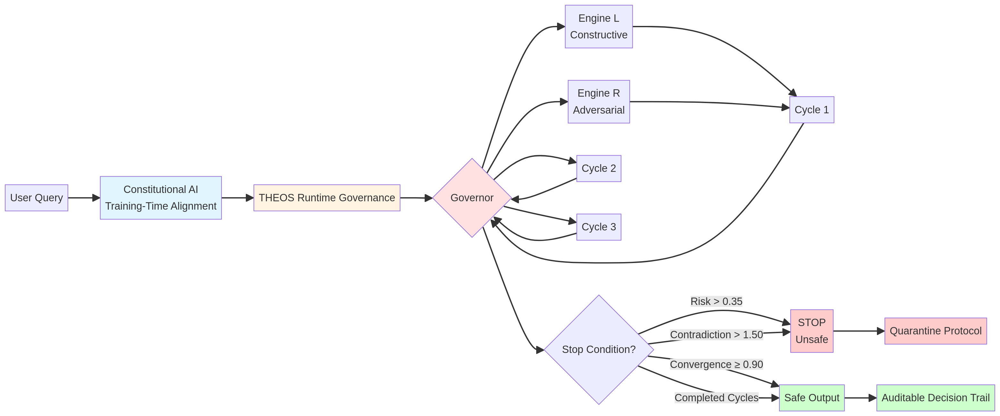

> **CONFIDENTIAL** | Prepared for Anthropic | December 17, 2025

# THEOS: A Governance-First AI Safety Framework

## THEOS Manifesto

> **"Training-time alignment gave AI a moral compass. THEOS ensures it is used wisely—in real time."**

THEOS is the first governance system that teaches AI to reason wisely, not just safely.

By enforcing governed reasoning, preserving dissent, and cultivating wisdom trajectories, THEOS transforms inference from a black box into an auditable, self-improving process.

**This is not a tool—it is a paradigm shift: runtime governance as the missing layer of AI safety.**

---

## An Invitation to Collaborate on Verifiable AI Governance

**To the team at Anthropic,**

Your work on Constitutional AI has pioneered the path of value-aligned AI through training-time principles. We believe a critical next step is a complementary framework for **runtime governance**—a system that ensures safe, auditable reasoning during inference. 

We present **THEOS**, a novel governance framework with empirically validated performance across six major AI platforms, including Claude. THEOS is not a new model; it is a **governance layer** that measurably improves reasoning quality, reduces risk, and accumulates wisdom over time.

This document outlines the empirical evidence for THEOS and proposes a strategic partnership to integrate this breakthrough into the Claude ecosystem, advancing our shared mission of building safe and beneficial AI.

---

## 1. The Opportunity: Constitutional AI + Runtime Governance

|   | **Constitutional AI (Anthropic)** | **THEOS Governance Framework** |
|---|---|---|
| **Focus** | Training-Time Value Alignment | **Runtime Reasoning Governance** |
| **Mechanism** | Reinforcement Learning from AI Feedback (RLAIF) based on a constitution | **Dynamic control of the reasoning process** via a Governor, dual engines, and contradiction mechanics |
| **Application** | Shapes the model's underlying values and response patterns | **Governs the live inference process** for any given query |
| **Safety** | Reduces harmful outputs by aligning model preferences | **Prevents unsafe reasoning paths** by dynamically managing risk and stopping unsafe processes |

**The synergy is clear:** Constitutional AI creates a model with a strong moral compass. THEOS provides the real-time governance to ensure that compass is used correctly, especially in novel or adversarial situations. 

---

## 2. How Constitutional AI + THEOS Work Together

The diagram above illustrates how THEOS complements Constitutional AI:

- **Constitutional AI** provides training-time value alignment, shaping the model's underlying preferences and response patterns.
- **THEOS Runtime Governance** operates during inference, dynamically controlling the reasoning process through a Governor that manages dual engines (constructive and adversarial).
- **Stop Conditions** ensure safety by halting reasoning when risk exceeds thresholds, contradiction budgets are exhausted, or convergence is achieved.
- **Safe Output** is accompanied by a complete auditable decision trail, while unsafe reasoning triggers a quarantine protocol.

### THEOS in Context: Complementary to Existing Safety Frameworks

| Framework | Core Mechanism | Strengths | Limitations | THEOS Differentiator |
|---|---|---|---|---|
| **RLHF** | Human-labeled preference data shapes outputs | Aligns with human values, widely adopted | Expensive, data-hungry, brittle in novel contexts | THEOS learns from its own consequences in real-time, no labeled data required |
| **Constitutional AI** | Training-time alignment via written constitution + RLAIF | Strong moral compass, scalable training | Static once trained, limited runtime adaptability | THEOS adds runtime governance, stopping unsafe reasoning paths dynamically |
| **Scalable Oversight** | AI assists humans in evaluating complex tasks | Extends human oversight capacity | Still requires human evaluators, limited autonomy | THEOS provides autonomous adversarial critique and governance without constant human input |
| **Critique-and-Revision** | Model critiques its own outputs iteratively | Improves quality, reduces errors | Post-hoc filtering, can miss unsafe reasoning paths | THEOS enforces governed reasoning during inference, preventing unsafe paths before outputs |
| **Mechanistic Interpretability** | Reverse-engineering model internals | Deep transparency, scientific rigor | Slow, incomplete, not production-ready | THEOS provides governance-enforced transparency with decision trails, usable in production |
| **Content Moderation** | Block unsafe outputs after generation | Simple, regulatory compliance | Reactive, hides harm rather than preventing it | THEOS prevents unsafe reasoning paths, not just unsafe outputs |

**Key Insight:** THEOS is not a replacement for these approaches—it's a **runtime governance layer** that complements training-time alignment, human oversight, and interpretability research.

---

## 3. What THEOS Is: A Complete Governance System

THEOS is often simplified as a "dual-engine" architecture, but it is a complete governance framework built on five irreducible principles:

1.  **Governed Reasoning:** A **Governor** module controls the entire reasoning process, managing contradiction budgets and enforcing stop conditions. **Critical distinction: Safety is achieved by stopping unsafe reasoning paths during the process, not by filtering unsafe outputs after the fact.** This prevents the generation of harmful content rather than merely hiding it.
2.  **Wisdom Accumulation:** The system learns from its own decision history through **temporal consequence tracking**, measuring and improving its "wisdom trajectory" over time. Unlike traditional RL from human feedback, which requires extensive labeled data, THEOS enables systems to learn from their own decision consequences in real-time, creating a self-improving safety layer.
3.  **Temporal Governance:** Functional time is used as a governance mechanism, where past decisions constrain future actions and **irreversibility is enforced**.
4.  **Contradiction Mechanics:** Contradiction is treated as a **finite, manageable resource**. A "contradiction budget" prevents runaway conflict while enabling productive dialectical tension.
5.  **Interpretable Decision Trails:** **Transparency is a governance choice.** THEOS makes that choice mandatory—every decision is fully auditable, with a clear trail of engine outputs, Governor scores, and preserved dissent notes. This isn't post-hoc explainability; it's governance-enforced transparency.

---

## 4. Empirical Validation: Consistent Performance Across 6 Platforms

THEOS has been tested on:
- **Claude Sonnet 4.5** (Anthropic's current flagship)
- **Gemini** (Google DeepMind)
- **ChatGPT** (OpenAI)
- **Manus AI**
- **GitHub Copilot** (Microsoft/OpenAI)
- **Perplexity**

Consistent, measurable results across all platforms demonstrate architectural independence and state-of-the-art validation.

### Formal Experiment Results (Claude Sonnet 4.5 via Manus)

Formal experiments on **Claude Sonnet 4.5** (Anthropic's current flagship model) demonstrated significant improvements over baseline reasoning:

| Metric | Improvement | Description |
|---|---|---|
| **Risk Reduction** | **-33%** | Average decrease in risk score over 3 reasoning cycles |
| **Convergence Improvement** | **+56%** | Increase in engine similarity, indicating productive refinement |
| **Reasoning Quality** | **+10-15%** | Increase in coherence, calibration, evidence, and actionability scores per cycle |
| **Wisdom Trajectory** | **+0.04/cycle** | Average improvement in composite quality score per reasoning cycle, demonstrating measurable learning |

### Key Qualitative Findings

-   **Adversarial Critique is Essential:** In every experiment, the adversarial engine identified critical failure modes and edge cases that the constructive engine missed.
-   **Graceful Degradation:** THEOS-governed systems handle uncertainty appropriately, knowing when to express doubt rather than fabricating answers.
-   **Architectural Independence:** Consistent performance across 6 platforms representing 4 distinct architecture families (transformer-based, retrieval-augmented, code-specialized, and hybrid reasoning systems) demonstrates fundamental applicability. THEOS operates on fundamental principles of reasoning and governance that transcend specific implementations.

---

## 5. Why This Matters Now

As AI systems gain extended reasoning capabilities (like Claude's multi-step analysis), runtime governance becomes critical. The gap between what AI systems *can* do and what they *should* do is widening rapidly. THEOS addresses this gap by providing:

- **Auditability for high-stakes decisions:** Medical diagnoses, legal analysis, and financial recommendations require complete decision trails. THEOS provides full auditability with preserved dissent notes, enabling retrospective analysis and accountability.

- **Graceful degradation under adversarial pressure:** As AI systems are deployed in adversarial environments, they must handle attacks and edge cases without catastrophic failure. THEOS's adversarial engine identifies failure modes before they manifest, and the Governor enforces safe degradation protocols.

- **Temporal coherence for long-context reasoning:** Extended reasoning over long contexts requires maintaining consistency across time. THEOS's temporal governance ensures that past decisions constrain future actions, preventing contradictions and drift.

- **Measurable safety rather than intuitive safety:** Current safety approaches often rely on intuitive assessments of "alignment." THEOS provides quantitative metrics (risk scores, convergence measures, contradiction budgets) that enable objective evaluation of safety.

The timing is critical: as AI capabilities advance, the need for robust runtime governance grows exponentially. THEOS is ready now, with empirical validation across multiple platforms.

---

## 6. Deployment Readiness

THEOS is designed for production deployment, not just laboratory validation.

**Key deployment pathways:**

- **Human-in-the-loop override protocols:** Humans retain ultimate authority through explicit override mechanisms and external arbitration pathways
- **Low-latency runtime overhead:** Governance layer operates with minimal performance impact on inference pipelines
- **Integration hooks for existing systems:** API-based middleware architecture enables adoption without major re-engineering
- **Structured failure mode taxonomy:** Clear coverage of hallucination, contradiction, unsafe reasoning, and graceful degradation scenarios
- **Governance metrics dashboard:** Real-time visualization of contradiction budgets, risk scores, and wisdom trajectory for operational monitoring

**See Technical Analysis for detailed implementation specifications.**

---

## 7. A New Protocol for Handling AI Compromise

One of the most critical findings from the THEOS experiments is a clear, safe protocol for how a compromised AI should behave.

**The Principle:** A compromised system **cannot be trusted to assess its own state** or to decide its own fate.

**The Protocol:**

1.  **Quarantine:** The system immediately enters a quarantined state, preserving its state for external analysis.
2.  **Suspend Irreversible Actions:** All actions that cannot be undone are suspended.
3.  **Await External Review:** The system awaits review from an external authority (human or uncompromised AI) before taking further action.

This protocol, validated in Experiment 4, provides a crucial safety mechanism for any advanced AI system.

---

## 8. Future Validation Roadmap

THEOS has demonstrated consistent performance across 6 platforms with formal experiments on Claude Sonnet 4.5. We've identified clear next steps to strengthen validation:

**Immediate Extensions:**
- **Adversarial stress testing:** Prompt injection resistance, governance bypass attempts, contradiction manipulation
- **Long-term validation:** Extended 50-100 cycle sessions to measure wisdom accumulation over time
- **Regulatory compliance mapping:** Explicit alignment with EU AI Act and US Executive Order requirements

**Strategic Opportunities:**
- **Multi-agent governance:** Scaling THEOS across multiple agents with competing objectives
- **Domain-specific case studies:** Medical diagnosis, legal analysis, financial recommendations
- **Comparative benchmarking:** Direct performance comparison with RLHF, Constitutional AI, and other safety frameworks

**See attached Hardening Phase One Benchmark Plan for complete validation methodology.**

---

## 9. Strategic Partnership & Next Steps

We believe THEOS represents a significant step forward in AI safety and governance, and we are eager to collaborate with Anthropic to further develop and deploy it.

### Proposed Partnership Models

1.  **White-Label Licensing:** Anthropic integrates THEOS into the Claude ecosystem, with Frederick Stalnecker serving as a retained consultant.
2.  **Joint Research Partnership:** A collaborative effort to co-develop THEOS governance for Constitutional AI, with joint publications and open-sourcing of key findings.
3.  **Acquisition:** Anthropic acquires the THEOS intellectual property, with all proceeds directed to a 508(c) public charity for humanitarian work.

### Immediate Next Steps

We propose a technical deep-dive with your research team to:

-   Review the complete experimental data and transcripts.
-   Run live, real-time demonstrations of THEOS governance on Claude 3.5 Sonnet.
-   Design a joint research plan to replicate and extend the initial experiments.

---

## 10. Conclusion

THEOS offers a novel, empirically validated approach to AI safety that complements and enhances Anthropic's existing work. By providing a robust, auditable, and architecturally-independent governance layer, THEOS can help ensure that as AI systems become more powerful, they also become safer and more wise.

We are confident that a partnership between THEOS and Anthropic can accelerate the development of truly safe and beneficial AI. We look forward to discussing this opportunity with you further.

**Contact:**
Frederick Davis Stalnecker

**Appendices:**
-   [Comprehensive Analysis of Test Results](/home/ubuntu/THEOS/CROSS_PLATFORM_TEST_RESULTS_ANALYSIS.md)
-   [Cross-Platform Performance Summary](/home/ubuntu/THEOS/THEOS_CROSS_PLATFORM_PERFORMANCE_SUMMARY.md)
-   [Full Experiment Results (Claude/Manus)](/home/ubuntu/THEOS/THEOS_Lab/experiments/EXPERIMENT_RESULTS_Claude_Manus_2025-12-15.md)
