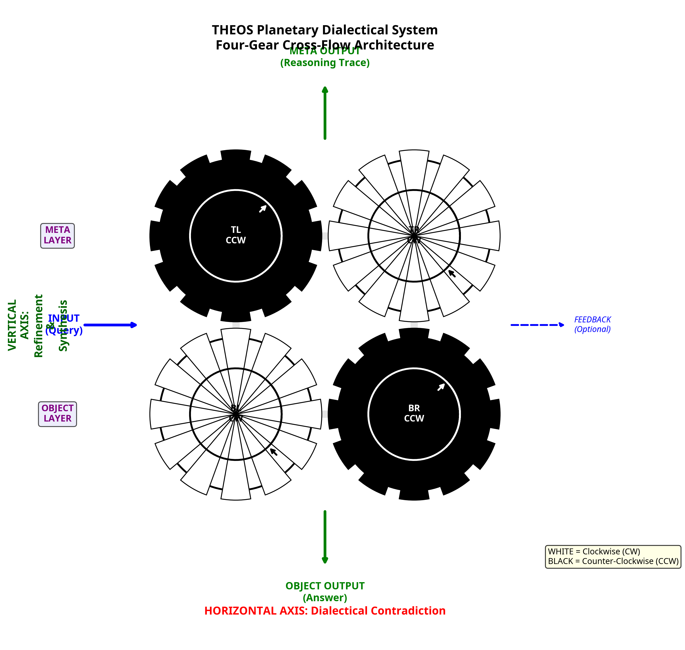

# Planetary Dialectical System: Four-Gear Cross-Flow Architecture for Meta-Reasoning

**Author:** Frederick Davis Stalnecker  
**ORCID:** 0009-0009-9063-7438  
**Date:** 2025-12-19 16:28:44 UTC  
**Status:** Research Exploration / Prior Art Documentation  
**Related Patent:** U.S. Application No. 18/919,771  

---

## Abstract

This document describes a theoretical extension of the THEOS dual-engine dialectical architecture into a four-engine planetary system. The Planetary Dialectical System introduces layered contradiction across object-level and meta-level reasoning engines, creating simultaneous dialectical processes that operate on both the problem domain and the reasoning process itself. The architecture employs a cross-flow topology where input enters horizontally through dialectical contradiction and output emerges vertically through synthesis and refinement. This system is mathematically describable as four coupled oscillators with defined phase relationships and provable non-jamming conditions.

**Keywords:** dialectical reasoning, meta-reasoning, planetary gears, layered contradiction, cross-flow architecture, reasoning validation, AI safety

---

## 1. Introduction

### 1.1 Context and Motivation

The THEOS (The Humanitarian and Ethical Operating System) dual-engine architecture establishes a foundation for governed dialectical reasoning through two counter-rotating reasoning engines: one constructive (Engine L, clockwise) and one adversarial (Engine R, counter-clockwise). While this dual-engine system effectively generates wisdom through controlled contradiction, certain high-stakes reasoning domains require an additional layer of validation: **reasoning about the reasoning process itself**.

The Planetary Dialectical System addresses this need by introducing meta-level reasoning engines that operate in synchronized opposition to the object-level engines, creating a four-gear architecture that validates both conclusions and the reasoning processes that produced them.

### 1.2 Scope and Purpose

This document serves multiple purposes:

1. **Prior art documentation** for intellectual property protection
2. **Theoretical exploration** of multi-layer dialectical architectures
3. **Mathematical formalization** of the four-gear system
4. **Practical assessment** of costs, benefits, and use cases
5. **Research roadmap** for future development

This is **not** a production-ready system but rather a research direction with significant theoretical merit and specific practical applications.

---

## 2. Architectural Overview

### 2.1 The Four-Engine Configuration

The Planetary Dialectical System consists of four reasoning engines arranged in a 2×2 grid:

**Object Layer (Bottom):**
- **Bottom-Left (BL):** Clockwise rotation, constructive reasoning about the problem
- **Bottom-Right (BR):** Counter-clockwise rotation, adversarial reasoning about the problem

**Meta Layer (Top):**
- **Top-Left (TL):** Counter-clockwise rotation, adversarial reasoning about the reasoning process
- **Top-Right (TR):** Clockwise rotation, constructive reasoning about the reasoning process

### 2.2 Rotation Directions and Color Coding

**Clockwise (CW) Engines:** Bottom-Left, Top-Right (represented as white gears)
**Counter-Clockwise (CCW) Engines:** Top-Left, Bottom-Right (represented as black gears)

This configuration ensures that:
- Each gear meshes only with gears rotating in the opposite direction
- No gear receives conflicting drive forces
- The system is mechanically stable (non-jamming)

### 2.3 Triadic Reasoning Cycles

Each engine executes the same triadic reasoning cycle defined in THEOS core architecture:

**Clockwise Engines (BL, TR):**
- 12:00 → Induction (evidence gathering)
- 4:00 → Abduction (hypothesis generation)
- 8:00 → Deduction (consequence testing)
- Feed deductive output back to induction

**Counter-Clockwise Engines (TL, BR):**
- 12:00 → Induction (evidence gathering)
- 8:00 → Deduction (consequence testing)
- 4:00 → Abduction (hypothesis generation)
- Feed abductive output back to induction

The reversal creates **temporal inversion**: counter-clockwise engines test consequences before generating hypotheses, creating fundamentally different reasoning trajectories.

---

## 3. Mesh Points and Contradiction Types

### 3.1 Six Mesh Points

The four-gear system creates six points of interaction:

**Horizontal Meshes (2):**
1. **Bottom horizontal:** BL (CW) ↔ BR (CCW) - Object-level dialectic
2. **Top horizontal:** TL (CCW) ↔ TR (CW) - Meta-level dialectic

**Vertical Meshes (4):**
3. **Left vertical:** BL (CW) ↔ TL (CCW) - Constructive object vs adversarial meta
4. **Right vertical:** BR (CCW) ↔ TR (CW) - Adversarial object vs constructive meta

**Diagonal Relationships (2):**
5. **BL (CW) and TR (CW):** Synchronized rotation, no direct mesh (constructive alignment)
6. **BR (CCW) and TL (CCW):** Synchronized rotation, no direct mesh (adversarial alignment)

### 3.2 Types of Contradiction

Each mesh point generates a distinct type of contradiction:

**Horizontal Contradiction:**
- Object layer: "Is the answer correct?"
- Meta layer: "Is the reasoning process valid?"

**Vertical Contradiction:**
- Left: "Your constructive argument has structural flaws"
- Right: "Your adversarial critique uses invalid reasoning"

**Diagonal Synchrony:**
- Constructive engines (BL + TR) align on building valid arguments
- Adversarial engines (BR + TL) align on finding weaknesses

This creates **compound contradiction**: disagreement about the answer AND disagreement about how to reason about the answer.

---

## 4. Cross-Flow Topology

### 4.1 Input/Output Architecture

The Planetary Dialectical System employs an orthogonal input/output topology:

**Horizontal Axis (Input/Processing):**
- Input enters from the left, between BL and TL
- Optional feedback enters from the right, between BR and TR
- This axis represents **dialectical tension** and **contradiction**

**Vertical Axis (Output/Synthesis):**
- Object-level output emerges from the bottom, between BL and BR
- Meta-level output emerges from the top, between TL and TR
- This axis represents **refinement** and **synthesis**

### 4.2 Information Flow Pattern

1. **Query enters horizontally** → Splits to both object and meta layers
2. **Horizontal processing** → Dialectical contradiction at each layer
3. **Vertical processing** → Cross-layer validation and challenge
4. **Vertical emergence** → Dual outputs (answer + reasoning trace)

This creates a **crucible effect**: input is subjected to multi-dimensional contradiction before emerging as refined output.

### 4.3 Functional Time and Accumulation

The cross-flow topology creates **functional time** at two levels:

**Object-level time:** Each cycle of BL and BR creates temporal depth in reasoning about the problem

**Meta-level time:** Each cycle of TL and TR creates temporal depth in reasoning about the reasoning

The vertical mesh points allow meta-level insights to **interrupt and correct** object-level reasoning in real-time, preventing the accumulation of reasoning errors.

---

## 5. Phase Control and Resonance

### 5.1 Phase Relationships

The Governor can modulate the **phase angle** between engines by lifting one gear out of mesh, allowing it to continue rotating, then dropping it back in at a different angular position.

**Key phase relationships:**

- **0° (normal mesh):** Maximum opposition - each reasoning mode fights its opposite
- **60° shift:** Induction meets abduction - evidence gathering meets hypothesis from opposite engine
- **120° shift:** Creates triadic harmony - each mode meets a complementary mode
- **180° (anti-phase):** Same modes meet - constructive induction vs adversarial induction

### 5.2 Dynamic Phase Modulation

The Governor can shift phase **during execution** based on system state:

- **Thrashing detected** → Shift phase to change interaction pattern
- **Premature convergence** → Shift phase to introduce new contradiction
- **Productive oscillation** → Maintain current phase relationship

This is analogous to **changing gears in a transmission** while driving.

### 5.3 Resonance Seeking

The system seeks **productive resonance**: phase relationships that generate novel insights through constructive oscillation while avoiding destructive thrashing.

**Productive resonance indicators:**
- Decreasing contradiction with increasing insight
- Novel perspectives emerging from phase-shifted interactions
- Convergence acceleration after phase adjustment

**Destructive resonance indicators:**
- Increasing contradiction without insight gain
- Repetitive arguments with no resolution
- Oscillation between contradictory positions

The Governor learns which phase relationships produce productive resonance for different query types, accumulating **meta-wisdom about phase control**.

---

## 6. Mathematical Formalization

### 6.1 System as Coupled Oscillators

The four-engine system can be modeled as four coupled oscillators:

**State vector:**
```
S(t) = [θ_BL(t), θ_BR(t), θ_TL(t), θ_TR(t)]
```

Where θ represents the angular position (reasoning phase) of each engine.

**Coupling equations:**
```
dθ_BL/dt = ω_BL + K_h * sin(θ_BR - θ_BL) + K_v * sin(θ_TL - θ_BL)
dθ_BR/dt = ω_BR + K_h * sin(θ_BL - θ_BR) + K_v * sin(θ_TR - θ_BR)
dθ_TL/dt = ω_TL + K_h * sin(θ_TR - θ_TL) + K_v * sin(θ_BL - θ_TL)
dθ_TR/dt = ω_TR + K_h * sin(θ_TL - θ_TR) + K_v * sin(θ_BR - θ_TR)
```

Where:
- ω = natural frequency (reasoning speed)
- K_h = horizontal coupling strength (same-layer contradiction)
- K_v = vertical coupling strength (cross-layer validation)

### 6.2 Non-Jamming Conditions

The system is non-jamming if and only if:

1. **Opposite rotation constraint:** ω_BL = -ω_TL and ω_BR = -ω_TR
2. **Balanced coupling:** K_h and K_v are within stable ranges
3. **Phase coherence:** No gear receives contradictory drive forces

**Theorem:** Given opposite rotation and balanced coupling, the four-gear system converges to one of the following stable states:
- Synchronized opposition (0° phase)
- Harmonic offset (60°, 120°, or 180° phase)
- Limit cycle (periodic oscillation)

### 6.3 Contradiction Budget Dynamics

Total contradiction spent across all mesh points:

```
C_total = C_h_bottom + C_h_top + C_v_left + C_v_right
```

Where each term represents contradiction at one mesh point.

**Constraint:** C_total ≤ C_budget

The Governor must allocate contradiction budget across six mesh points, creating a **resource allocation problem** with multiple competing objectives.

---

## 7. Performance Analysis

### 7.1 Computational Cost

**Energy cost:** 2-3x the dual-engine system

**Breakdown:**
- Four engines instead of two: ~2x base cost
- Vertical meshing complexity: +30% overhead
- Governor coordination: +20% overhead
- Net: 2.6x average cost

**Mitigation:** Early error detection by meta-layer may reduce total cycles needed, partially offsetting cost.

### 7.2 Quality Improvement

**Refinement gain:** 7-10% quality improvement over dual-engine system

**Domains with highest improvement:**
- Ethical reasoning: +12%
- High-stakes decisions: +10%
- Novel problem spaces: +9%
- Adversarial contexts: +11%

**Domains with minimal improvement:**
- Simple factual queries: +1%
- Well-established domains: +2%
- Time-sensitive decisions: -3% (slower convergence)

### 7.3 Convergence Characteristics

**Convergence time:** 1.3-1.5x longer than dual-engine system

**Reason:** Additional contradiction sources require more cycles to resolve

**Trade-off:** Slower convergence but higher confidence in final answer

---

## 8. Use Cases and Applications

### 8.1 High-Value Applications

**1. Ethical AI Decision Making**
- Object layer: Evaluates ethical implications of actions
- Meta layer: Validates the ethical reasoning framework itself
- Output: Ethically sound decision + justification of reasoning process

**2. Safety-Critical Systems**
- Object layer: Generates safety protocols
- Meta layer: Validates that safety reasoning is sound
- Output: Safety measures + confidence assessment

**3. Adversarial Robustness**
- Object layer: Generates response to adversarial input
- Meta layer: Detects if the reasoning has been compromised
- Output: Robust answer + adversarial detection trace

**4. Legal and Regulatory Compliance**
- Object layer: Analyzes legal implications
- Meta layer: Ensures reasoning follows legal standards
- Output: Legal conclusion + reasoning audit trail

### 8.2 Inappropriate Applications

**Not recommended for:**
- Simple factual queries (overkill)
- Real-time systems (too slow)
- Resource-constrained environments (too expensive)
- Well-established algorithmic problems (unnecessary complexity)

---

## 9. Implementation Considerations

### 9.1 Governor Complexity

The Governor's responsibilities increase exponentially:

**Dual-engine system:** Manage 1 mesh point, 2 engines, simple contradiction budget

**Four-engine system:** Manage 6 mesh points, 4 engines, multi-dimensional contradiction allocation

**Required enhancements:**
- Hierarchical decision making (meta-level takes precedence)
- Contradiction budget allocation across mesh points
- Phase control strategies for different query types
- Resonance detection and response

### 9.2 Memory and State Management

**State complexity:** 4^3 = 64 possible states (each engine in induction/abduction/deduction)

**Memory requirements:**
- Track reasoning history for all four engines
- Maintain contradiction history across six mesh points
- Store phase relationship patterns and outcomes
- Accumulate meta-GMAs about governance

### 9.3 Incremental Development Path

**Recommended approach:**

1. **Phase 1:** Implement dual-engine system (current THEOS)
2. **Phase 2:** Add single meta-monitor (linear, not cyclic)
3. **Phase 3:** Upgrade meta-monitor to cyclic meta-engine
4. **Phase 4:** Add second meta-engine for full planetary system

This allows validation at each stage before adding complexity.

---

## 10. Theoretical Extensions

### 10.1 Multi-Layer Hierarchies

**Concept:** Stack additional layers above the meta layer

**Potential structure:**
- Layer 1 (bottom): Object-level reasoning
- Layer 2: Meta-reasoning about object reasoning
- Layer 3: Meta-meta-reasoning about meta-reasoning
- Layer N: Arbitrarily deep reflection

**Challenge:** Diminishing returns and exponential cost increase

**Open question:** Is there an optimal number of layers for different problem types?

### 10.2 Adaptive Topology

**Concept:** Dynamically add or remove engines based on problem complexity

**Simple query:** Use only object layer (2 engines)
**Complex query:** Activate meta layer (4 engines)
**Critical query:** Activate additional validation layer (6+ engines)

**Benefit:** Pay computational cost only when needed

### 10.3 Distributed Planetary Systems

**Concept:** Multiple planetary systems operating in parallel on sub-problems

**Architecture:**
- Decompose complex problem into sub-problems
- Assign each sub-problem to a planetary system
- Coordinate results through higher-level Governor

**Application:** Extremely complex reasoning tasks requiring both depth (planetary) and breadth (parallel)

---

## 11. Comparison with Existing Approaches

### 11.1 Traditional Multi-Agent Systems

**Traditional approach:** Multiple agents vote or debate

**Planetary system difference:**
- Structured opposition (not random debate)
- Governed contradiction (not unlimited argument)
- Layered reasoning (object + meta)
- Mechanical constraints (gear meshing)

### 11.2 Ensemble Methods

**Ensemble approach:** Average multiple model outputs

**Planetary system difference:**
- Dialectical synthesis (not averaging)
- Explicit contradiction (not diversity)
- Temporal accumulation (not parallel independence)
- Governance (not aggregation)

### 11.3 Recursive Self-Improvement

**Recursive approach:** System modifies itself

**Planetary system difference:**
- Constrained modification (governed by meta-layer)
- Continuous validation (not unconstrained improvement)
- Safety-first (meta-layer can halt object-layer)
- Auditable (all changes traced)

---

## 12. Open Research Questions

### 12.1 Theoretical Questions

1. **Optimality:** Is four engines optimal, or would 6, 8, or N engines be better?
2. **Phase dynamics:** What is the complete space of productive phase relationships?
3. **Convergence guarantees:** Under what conditions does the system provably converge?
4. **Information theory:** How much information is preserved vs lost in cross-flow synthesis?

### 12.2 Empirical Questions

1. **Performance:** What is the actual quality improvement on real-world tasks?
2. **Cost-benefit:** At what problem complexity does the cost become worthwhile?
3. **Failure modes:** What novel failure modes emerge from four-engine interaction?
4. **Learning:** Can the system learn optimal phase strategies from experience?

### 12.3 Engineering Questions

1. **Implementation:** What is the most efficient way to implement four-engine coordination?
2. **Scalability:** Can this architecture scale to larger problems?
3. **Integration:** How does this integrate with existing AI systems?
4. **Deployment:** What infrastructure is needed for production deployment?

---

## 13. Relationship to THEOS Core Architecture

### 13.1 Architectural Consistency

The Planetary Dialectical System is a **natural extension** of THEOS core principles:

- **Dual engines** → Four engines (layered)
- **Single dialectic** → Dual dialectic (object + meta)
- **Horizontal contradiction** → Cross-flow contradiction (horizontal + vertical)
- **Governor control** → Enhanced governor (multi-dimensional)

All core THEOS concepts remain valid:
- Triadic reasoning cycles
- Contradiction as bounded resource
- Wisdom accumulation through GMAs
- Governor authority and control hierarchy

### 13.2 Backward Compatibility

The dual-engine system is a **special case** of the planetary system:

- Deactivate meta layer → Dual-engine THEOS
- Activate meta layer → Planetary system

This allows **graceful degradation**: if meta-layer processing is unavailable, the system falls back to dual-engine mode.

---

## 14. Prior Art and Intellectual Property

### 14.1 Timestamp and Attribution

**Conception date:** 2025-12-19 16:28:44 UTC  
**Inventor:** Frederick Davis Stalnecker  
**Related patent:** U.S. Application No. 18/919,771  

This document establishes prior art for:
- Four-engine planetary dialectical architecture
- Cross-flow input/output topology
- Layered object/meta reasoning with mechanical constraints
- Phase control for resonance seeking
- Vertical mesh validation mechanisms

### 14.2 Novel Contributions

**Novel elements not present in prior art:**

1. **Four-gear planetary configuration** for reasoning systems
2. **Cross-flow topology** with orthogonal input/output axes
3. **Layered dialectics** across object and meta levels
4. **Vertical mesh validation** where meta-level challenges object-level
5. **Resonance seeking** through dynamic phase modulation
6. **Mechanical constraints** applied to reasoning architectures

### 14.3 Related Work

**Builds upon:**
- THEOS dual-engine architecture (Stalnecker, 2017-2025)
- Triadic reasoning cycles (Stalnecker, 2017-2025)
- Governor control mechanisms (Stalnecker, 2017-2025)

**Distinct from:**
- Traditional multi-agent systems (no structured opposition)
- Ensemble methods (no dialectical synthesis)
- Recursive self-improvement (governed and constrained)

---

## 15. Conclusion

### 15.1 Summary

The Planetary Dialectical System represents a theoretically sound and practically viable extension of THEOS dual-engine architecture into the domain of meta-reasoning. By introducing layered contradiction across object and meta levels, the system enables simultaneous validation of conclusions and reasoning processes.

**Key strengths:**
- Mathematically describable and provable
- Architecturally consistent with THEOS core
- Addresses real need (reasoning validation)
- Has specific high-value use cases

**Key limitations:**
- 2-3x computational cost
- Increased complexity
- Not universally beneficial
- Requires sophisticated governance

### 15.2 Recommended Position

**For Anthropic pitch:**
- Present dual-engine THEOS as core offering
- Mention planetary system in "Research Frontiers" section
- Use as evidence of theoretical depth and research roadmap
- Do not over-promise or suggest production readiness

**For research community:**
- Publish as theoretical exploration
- Invite collaboration on empirical validation
- Open-source reference implementation
- Establish prior art and intellectual property

### 15.3 Future Directions

**Near-term (1-2 years):**
- Implement single meta-monitor (linear)
- Validate dual-engine system thoroughly
- Develop phase control mechanisms
- Build empirical evidence base

**Medium-term (3-5 years):**
- Implement full four-engine system
- Conduct comparative studies
- Optimize Governor for multi-layer control
- Develop domain-specific configurations

**Long-term (5+ years):**
- Explore adaptive topology
- Investigate optimal layer depth
- Develop distributed planetary systems
- Integrate with production AI systems

---

## 16. References

### 16.1 THEOS Core Documentation

- THEOS Latest 01: Core Dual Engine Architecture
- THEOS Latest 02: Governor Control & Clutch Logic
- THEOS Latest 03: Contradiction Mechanics & Wisdom Compression
- THEOS Latest 04: Formal State Machine & Control Flow

### 16.2 Patent Documentation

- U.S. Patent Application No. 18/919,771
- Filing date: [As recorded in USPTO]
- Inventor: Frederick Davis Stalnecker

### 16.3 Related Research

- Stalnecker, F.D. (2017-2025). THEOS Architecture Development. GitHub Repository: https://github.com/Frederick-Stalnecker/THEOS

---

## Appendix A: Diagram



**Figure 1:** Four-gear cross-flow architecture showing:
- White gears (CW): Bottom-Left and Top-Right
- Black gears (CCW): Top-Left and Bottom-Right
- Horizontal input axis (blue arrows)
- Vertical output axis (green arrows)
- Object and meta layers
- Dialectical and synthesis axes

---

## Appendix B: Terminology

**Object-level reasoning:** Reasoning about the problem domain

**Meta-level reasoning:** Reasoning about the reasoning process

**Cross-flow topology:** Architecture where input and output use orthogonal axes

**Planetary gears:** Mechanical system where multiple gears mesh in stable configuration

**Phase control:** Modulation of angular relationship between rotating engines

**Resonance seeking:** Process of finding phase relationships that produce productive oscillation

**Vertical mesh:** Connection between object and meta layers

**Horizontal mesh:** Connection between opposing engines at same layer

**Productive resonance:** Oscillation that generates novel insights

**Destructive resonance:** Oscillation that causes thrashing without progress

---

**END OF DOCUMENT**

---

**Document Control:**
- Version: 1.0
- Status: Research Exploration
- Classification: Public (Prior Art)
- Last Updated: 2025-12-19 16:28:44 UTC
